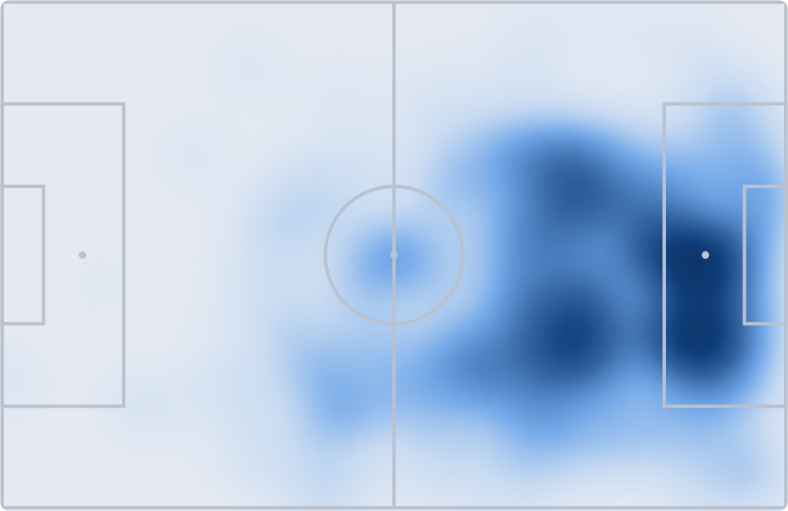
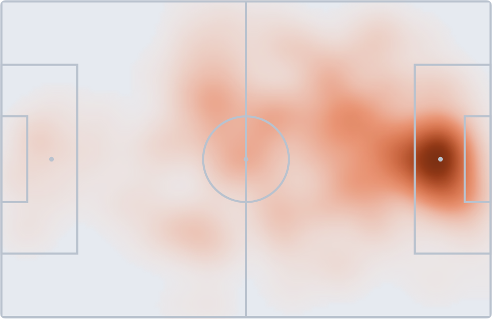

# Esempio ragionato — le posizioni di un giocatore, dal dato alla lettura

Quaderno nato da una sessione vera del 12/08/2026: *«voglio vedere la heatmap di
Malen con la Roma nella stagione 25-26 e confrontarla con quella di Haaland
nella seconda metà»*. La domanda è piccola, il percorso ha pagato **sette
trappole più un corollario** e prodotto un metodo riusabile. Questo è il verbale,
scritto per essere ri-eseguito da terzi su qualunque altro giocatore.

## Cos'è e cosa NON è

**È** un esempio eseguibile: `heatmap_giocatore.py` produce ogni numero citato
qui, e i cinque capitoli spiegano le convenzioni, le trappole, come si legge una
mappa, come si disegna e come si consegna.

**NON è** una fase del progetto: nessun modello è stato addestrato, nessuna
previsione fatta, nessuna riga aggiunta a `experiments/runs.jsonl`. È
un'**analisi descrittiva** di due giocatori su una finestra di partite, e non
autorizza da sola nessuna conclusione predittiva (§1.10 del `CLAUDE.md`: un
risultato vale per i dati su cui è misurato — qui, 34 partite di due campionati).

## I cinque capitoli

| | |
|---|---|
| [01 — Convenzioni e trappole](01_convenzioni_e_trappole.md) | I due sistemi di coordinate dello stesso bundle, l'identità per ID, i tiri scritti due volte. **Da leggere prima di toccare i dati** |
| [02 — Come si fa](02_come_si_fa.md) | La procedura in sette passi, con il codice |
| [03 — Come si legge](03_come_si_legge.md) | Cosa guardare, cosa è rilevante, cosa è artefatto, cosa non si può dire |
| [04 — Come si disegna](04_come_si_disegna.md) | Le lezioni di visualizzazione, tutte pagate con un difetto visto a schermo |
| [05 — Artefatti e consegna](05_artefatti_e_consegna.md) | Come si usa un artifact, cosa va scritto dentro sempre, e perché un numero non si ricalcola nel grafico |

## Come si esegue

```bash
python docs/esempio_heatmap_giocatori/heatmap_giocatore.py \
    --lega serie_a --giocatore "Donyell Malen"
python docs/esempio_heatmap_giocatori/heatmap_giocatore.py \
    --lega premier_league --id 839956 --da-giornata 20
```

Lo script **si ferma** se le convenzioni di coordinate non sono quelle attese
(§1 del capitolo 01): è un controllo che costa due righe e salva un'analisi
intera.

## Il risultato dell'esempio

Donyell Malen (AS Roma, giornate 21-38 di Serie A: il suo intero periodo alla
Roma **è** la seconda metà) contro Erling Haaland (Manchester City, giornate
20-37 di Premier).




| | Malen | Erling |
|---|--:|--:|
| posizioni · partite | 605 · 18 | 463 · 16 |
| **dentro l'area avversaria** | **27,9%** | **27,2%** |
| terzo offensivo | 64,0% | 53,8% |
| terzo difensivo | 4,0% | 8,4% |
| corsia destra | 36,9% | 13,4% |
| corsia centrale | 49,6% | 65,2% |
| posizione media in profondità | 70,6 | 64,9 |
| escursione verticale (sd) | 18,8 | 22,7 |
| posizioni per 90′ | 36,8 | 31,8 |
| tiri · gol | 70 · 14 | 56 · 8 |
| distanza mediana del tiro | 11,1 m | 10,5 m |
| tiri nel corridoio centrale | 78,6% | 94,6% |

**La lettura in una riga:** la presenza in area è la stessa a mezzo punto
percentuale, la forma con cui ci arrivano è opposta. Malen sta alto e larghissimo
a destra; Erling vive nel corridoio centrale, scende nel proprio terzo il doppio
delle volte e ha un'escursione verticale più ampia — arretra per ricevere.

Il dettaglio contro-intuitivo, e perché è credibile: **Malen risulta più
avanzato di Haaland** (70,6 contro 64,9), che per un esterno contro un
centravanti sembra sbagliato. Tre misure indipendenti concordano — terzo
difensivo 4,0% contro 8,4%, escursione 18,8 contro 22,7, X media 70,6 contro
64,9 — e raccontano tutte la stessa cosa: non è Malen a essere più offensivo, è
Haaland ad abbassarsi. Un solo numero non basterebbe; tre che convergono sì.

## La lezione di metodo più importante

**«Il dato non esiste» ha una data di scadenza.** Alle 14:13 la heatmap di
Haaland non era nel repo, e la conclusione — verificata su tre meccanismi di
accesso diversi — era corretta. Alle 14:36 un commit ha aggiunto
`files/tre_fonti_premier_league_2526/` e la stessa frase era falsa.

Non c'era nessun errore nella prima analisi: c'era una formulazione che l'ha
salvata. Era scritto *«non è in questo progetto»* con il perimetro accanto, non
*«non esiste»*. La prima si aggiorna con un `git pull`; la seconda avrebbe
chiuso una pista.

Regola operativa: **un'assenza si dichiara con il perimetro e il commit**
(«non presente in `files/` a `4579f5c`»), mai in astratto. È lo stesso principio
§1.10 del `CLAUDE.md`, applicato ai dati invece che ai risultati negativi.

**È poi successo una seconda volta nella stessa ora**: mentre scrivevo il
capitolo 02, il commit `e663302` ha aggiunto anche **La Liga** (570.768
posizioni) e la tabella del perimetro era da riscrivere di nuovo. Per questo ogni
tabella di copertura di questo quaderno porta accanto il comando per
ri-generarsela — un elenco scritto a mano qui dentro ha l'emivita di un'ora.

## Dove sta cosa

```
docs/esempio_heatmap_giocatori/
  README.md                       questo file
  01_convenzioni_e_trappole.md    le sette trappole, in ordine di costo
  02_come_si_fa.md                la procedura
  03_come_si_legge.md             l'interpretazione
  04_come_si_disegna.md           la visualizzazione
  05_artefatti_e_consegna.md      la consegna: artifact, provenienza, limiti
  heatmap_giocatore.py            lo script: ogni numero di qui esce da lui
  heatmap/                        le immagini, chiaro e scuro
```

Le immagini, tutte esportate dalla pagina interattiva:

| file | cosa |
|---|---|
| `malen_posizioni.png` · `erling_posizioni.png` | le due heatmap |
| `malen_tiri.png` · `erling_tiri.png` | le due mappe dei tiri, porta in alto |
| `*_scuro.png` | gli stessi quattro nel tema scuro — servono a **vedere** la lezione del capitolo 04 §1 (la rampa che si inverte) |
| `pagina_intera.png` | la pagina completa, come riferimento di impaginazione |

La pagina interattiva costruita nella sessione (heatmap con tooltip per zona,
mappe dei tiri, confronto per 90′) sta come artifact e **non** in questo repo:
è un artefatto di presentazione, non una fonte. Le immagini in `heatmap/` sono
la sua esportazione.

## Fonti usate

| Cosa | File |
|---|---|
| posizioni tocco-per-tocco | `files/tre_fonti_{serie_a,premier_league}_2526/heatmap.csv.gz` |
| tiri con coordinate | `files/tre_fonti_{...}_2526/eventi.csv.gz`, categoria `Tiro` |
| ruoli (per la verifica) | `files/tre_fonti_{...}_2526/giocatori.csv.gz` |
| statistiche per partita | `files/diretta_{serie_a,premier_league}_2526/` |

Le posizioni esistono **solo per le leghe con la raccolta a tre fonti** — al
12/08/2026 Serie A, Premier e La Liga 2025-26. Per Bundesliga e Ligue 1 il
progetto ha le statistiche per partita ma non le coordinate: lì questo quaderno
non si applica finché quella raccolta non arriva. L'elenco autorevole non è
questa riga, è:

```bash
ls -d files/tre_fonti_*_2526/
```
